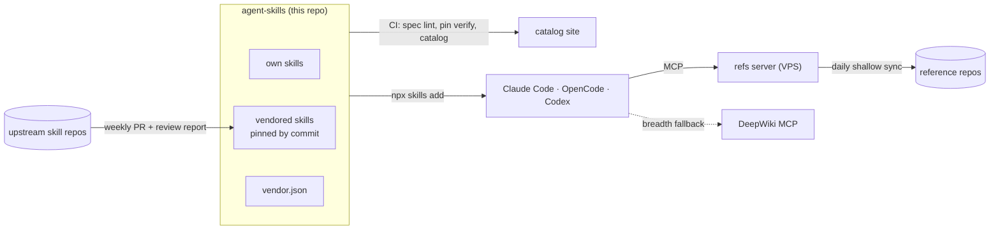

# agent-skills

[](https://github.com/Egoushka/agent-skills/actions/workflows/ci.yml)
[](https://github.com/Egoushka/agent-skills/actions/workflows/upstream-sync.yml)
[](https://egoushka.github.io/agent-skills/)
[](LICENSE)

A curated set of [Agent Skills](https://agentskills.io) for Claude Code, OpenCode, Codex and the other agents that read `SKILL.md`. It holds my own skills plus upstream ones I've reviewed, each upstream skill pinned to a commit. Every skill shows what it costs in context.

The **[catalog site](https://egoushka.github.io/agent-skills/)** is the visual version of this page: token budgets per skill, upstream updates waiting for review, and recent activity.

## Install

```bash
npx skills add Egoushka/agent-skills                        # choose skills and agents interactively
npx skills add Egoushka/agent-skills -g -s dev-references   # one skill, user-wide
npx skills add Egoushka/agent-skills -g -a claude-code -a opencode -s '*' -y
npx skills update                                           # pull what changed since
```

[`skills`](https://github.com/vercel-labs/skills) keeps one copy per machine and symlinks it into each agent's folder, so updating it once updates every agent.

## Catalog

<!-- catalog:start -->
<!-- generated by tools/catalog.py; do not edit by hand -->
| Skill | Origin | What it is for | Always loaded | On activation |
|---|---|---|--:|--:|
| [`design-taste-frontend`](skills/design-taste-frontend) | [Leonxlnx/taste-skill@ce26fc2](https://github.com/Leonxlnx/taste-skill/tree/ce26fc25c0e5e8cab638f883de62d9a86ee5e45b/skills/taste-skill) · MIT | Anti-slop frontend skill for landing pages, portfolios, and redesigns. | ≈73 | ≈21.7k ⚠ |
| [`dev-references`](skills/dev-references) | own | Searches curated developer reference corpora and answers with cited links or sections. | ≈146 | ≈740 |
| [`playwright-cli`](skills/playwright-cli) | [microsoft/playwright-cli@74354ec](https://github.com/microsoft/playwright-cli/tree/74354ecc7a43da16d91a9bc54fa8db8283a3fcf5/skills/playwright-cli) · Apache-2.0 | Automate browser interactions, test web pages and work with Playwright tests. | ≈24 | ≈3.7k |

All 3 skills together cost ≈243 tokens in every session (names and descriptions); a body loads only when its skill fires. ⚠ marks a body over the 5,000-token guideline. Token counts are estimates (characters ÷ 4).
<!-- catalog:end -->

## How it fits together



The system has three layers, and each lives where its kind of content belongs:

- **Skills are instructions.** They are small, so they are copied onto every machine, the way `dotnet restore` puts packages locally. `vendor.json` does the job of `packages.lock.json`.
- **Reference corpora are data.** They are large, change daily, and some are licensed for personal use only, so they stay on one server and agents query them like an internal API. The [`dev-references`](skills/dev-references/SKILL.md) skill teaches agents to query them; [`refs/`](refs/README.md) is the server.
- **DeepWiki is breadth.** It covers any public repository the corpora don't. It answers with generated text, so the skill tells agents to check what it says against the files it cites.

## Maintaining

| Command | What it does |
|---|---|
| `make check` | What CI runs offline: spec lint, unit tests, catalog drift |
| `make catalog` | Regenerates the catalog block above from the skills themselves |
| `make vendor-status` | Pinned commit vs upstream HEAD for each vendored skill |
| `make vendor-update` | Moves pins to upstream HEAD and writes `upstream-report.md` |
| `make verify` | Checks that vendored skills are byte-identical to their pinned upstream |
| `make site` | Builds the catalog site into `_site/` |
| `make refs-update` | Builds the reference index locally (for offline use) |

**Add your own skill:** create `skills/<name>/SKILL.md`, follow [docs/authoring.md](docs/authoring.md), add trigger cases in `evals/<name>.json`, then run `make check catalog`.

**Vendor someone else's skill:** add an entry to `vendor.json` (repo, path, commit, license, and a line on why it earns its context), then run `make vendor-sync catalog`. Install first-party marketplaces such as [dotnet/skills](https://github.com/dotnet/skills) or [anthropics/skills](https://github.com/anthropics/skills) straight from their publishers instead; see [ADR 0002](docs/adr/0002-vendor-and-pin-community-skills.md).

## Security model

Installing a skill hands instructions and scripts to an agent that runs with your permissions. In Snyk's [ToxicSkills study](https://snyk.io/blog/toxicskills-malicious-ai-agent-skills-clawhub/) (February 2026), 1,467 of 3,984 public skills (36%) had security flaws, and 76 carried confirmed malicious payloads. So here:

- Every vendored skill is pinned to a commit, and CI fails if it differs from upstream at that commit by even one byte.
- Upstream changes arrive only as pull requests. The review report flags changed `allowed-tools`, added or changed scripts, new URLs and description changes, because a description change alters when the skill fires.
- `validate.py` blocks likely secrets and warns about broad `allowed-tools` grants. For example, `playwright-cli` pre-approves `npx` and `npm`, and the catalog says so.
- Workflows use actions pinned by commit, with Dependabot proposing the bumps.

## Decisions

- [0001: A Git repository is the skills hub](docs/adr/0001-git-repository-as-skills-hub.md)
- [0002: Vendor and pin community skills](docs/adr/0002-vendor-and-pin-community-skills.md)
- [0003: Reference corpora are a search service, not skill content](docs/adr/0003-reference-corpora-as-a-search-service.md)

## License

My own content is MIT. Each vendored skill keeps its upstream license, and its `LICENSE` file sits inside the skill folder. The reference corpora are not redistributed: only the list of what to index is published.
