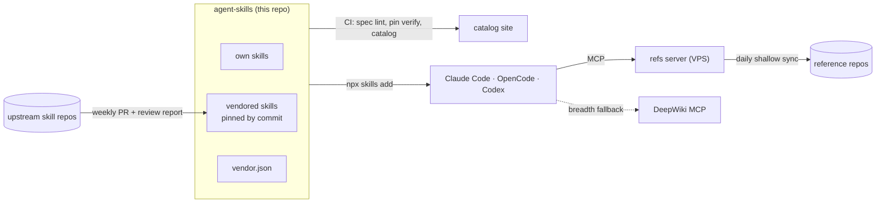

# agent-skills

[](https://github.com/Egoushka/agent-skills/actions/workflows/ci.yml)
[](https://github.com/Egoushka/agent-skills/actions/workflows/upstream-sync.yml)
[](https://egoushka.github.io/agent-skills/)
[](LICENSE)

A curated set of [Agent Skills](https://agentskills.io) for Claude Code, OpenCode, Codex and the other agents that read `SKILL.md`. It holds my own skills plus upstream ones I've reviewed, each upstream skill pinned to a commit. Every skill shows what it costs in context.

The **[catalog site](https://egoushka.github.io/agent-skills/)** is the visual version of this page: token budgets per skill, upstream updates waiting for review, and recent activity.

## Install

```bash
npx skills add Egoushka/agent-skills                        # choose skills and agents interactively
npx skills add Egoushka/agent-skills -g -s dev-references   # one skill, user-wide
npx skills add Egoushka/agent-skills -g -a claude-code -a opencode -s '*' -y
npx skills update                                           # pull what changed since
```

[`skills`](https://github.com/vercel-labs/skills) keeps one copy per machine and symlinks it into each agent's folder, so updating it once updates every agent.

To stay current automatically, install the daily job with `./tools/sync/install-macos.sh`. It runs `npx skills update` and stages changed skills for Claude Desktop, which only accepts manual uploads. See [docs/sync.md](docs/sync.md).

## Catalog

<!-- catalog:start -->
<!-- generated by tools/catalog.py; do not edit by hand -->
| Skill | Origin | What it is for | Always loaded | On activation |
|---|---|---|--:|--:|
| [`agentic-actions-auditor`](skills/agentic-actions-auditor) | [trailofbits/skills@0cc1c73](https://github.com/trailofbits/skills/tree/0cc1c73a5e96749ab32d7ea5e14892fafa6972ae/plugins/agentic-actions-auditor/skills/agentic-actions-auditor) · CC-BY-SA-4.0 | Audits GitHub Actions workflows for security vulnerabilities in AI agent integrations including Claude Code Action, Gemini CLI, OpenAI Codex, and GitHub AI Inference. | ≈149 | ≈5.3k ⚠ |
| [`alerting-irm`](skills/alerting-irm) | [grafana/skills@1ccacf2](https://github.com/grafana/skills/tree/1ccacf29049fde66637fe01ab93a83a772da323b/skills/grafana-core/alerting-irm) · Apache-2.0 | Configure Grafana Alerting, Incident Response Management, and SLOs end-to-end — provisions Grafana-managed and data-source-managed alert rules, contact points,… | ≈220 | ≈1.7k |
| [`analyzing-dotnet-performance`](skills/analyzing-dotnet-performance) | [dotnet/skills@a55fbf4](https://github.com/dotnet/skills/tree/a55fbf42c36a37b94ec07291bd79cb6b6bf3a04d/plugins/dotnet-diag/skills/analyzing-dotnet-performance) · MIT | Scans .NET code for ~50 performance anti-patterns across async, memory, strings, collections, LINQ, regex, serialization, and I/O with tiered severity classification. | ≈80 | ≈3.0k |
| [`angular-developer`](skills/angular-developer) | [angular/skills@bb6fb99](https://github.com/angular/skills/tree/bb6fb990438bb28840ed0cd8f0f08e51c295f1ce/angular-developer) · MIT (declared in SKILL.md; repository has no license file) | Generates Angular code and provides architectural guidance. | ≈101 | ≈2.6k |
| [`brainstorming`](skills/brainstorming) | [obra/superpowers@5bf4e78](https://github.com/obra/superpowers/tree/5bf4e78011075bcfc0dc295f0724994cd123ee71/skills/brainstorming) · MIT | You MUST use this before any creative work - creating features, building components, adding functionality, or modifying behavior. | ≈54 | ≈4.3k |
| [`cloudflare-one`](skills/cloudflare-one) | [cloudflare/skills@626547c](https://github.com/cloudflare/skills/tree/626547c06881a20b3322bdc2ed6e6451b33a4fb6/skills/cloudflare-one) · Apache-2.0 | Design, configure, troubleshoot, or review Cloudflare One Zero Trust and SASE deployments. | ≈45 | ≈5.7k ⚠ |
| [`configuring-opentelemetry-dotnet`](skills/configuring-opentelemetry-dotnet) | [dotnet/skills@a55fbf4](https://github.com/dotnet/skills/tree/a55fbf42c36a37b94ec07291bd79cb6b6bf3a04d/plugins/dotnet-aspnetcore/skills/configuring-opentelemetry-dotnet) · MIT | Configure OpenTelemetry distributed tracing, metrics, and logging in ASP.NET Core using the .NET OpenTelemetry SDK. | ≈72 | ≈2.8k |
| [`convert-to-cpm`](skills/convert-to-cpm) | [dotnet/skills@a55fbf4](https://github.com/dotnet/skills/tree/a55fbf42c36a37b94ec07291bd79cb6b6bf3a04d/plugins/dotnet-nuget/skills/convert-to-cpm) · MIT | Convert .NET projects and solutions to NuGet Central Package Management using Directory.Packages.props. | ≈217 | ≈3.3k |
| [`create-datadriven-aspnetcore`](skills/create-datadriven-aspnetcore) | [dotnet/skills@a55fbf4](https://github.com/dotnet/skills/tree/a55fbf42c36a37b94ec07291bd79cb6b6bf3a04d/plugins/dotnet-data/skills/create-datadriven-aspnetcore) · MIT | Generate or scaffold ASP.NET Core code — Razor Pages, Blazor components, MVC controllers, views, and Minimal API endpoints — without using ASP.NET Core CLI… | ≈167 | ≈3.0k |
| [`dashboarding`](skills/dashboarding) | [grafana/skills@1ccacf2](https://github.com/grafana/skills/tree/1ccacf29049fde66637fe01ab93a83a772da323b/skills/grafana-core/dashboarding) · Apache-2.0 | Build, modify, and ship Grafana dashboards as JSON via the HTTP API — panel types, `gridPos` 24-column layout, units, thresholds, template + datasource + chained… | ≈247 | ≈1.1k |
| [`design-taste-frontend`](skills/design-taste-frontend) | [Leonxlnx/taste-skill@ce26fc2](https://github.com/Leonxlnx/taste-skill/tree/ce26fc25c0e5e8cab638f883de62d9a86ee5e45b/skills/taste-skill) · MIT | Anti-slop frontend skill for landing pages, portfolios, and redesigns. | ≈73 | ≈21.7k ⚠ |
| [`dev-references`](skills/dev-references) | own | Searches curated developer reference corpora and answers with cited links or sections. | ≈146 | ≈740 |
| [`dotnet-trace-collect`](skills/dotnet-trace-collect) | [dotnet/skills@a55fbf4](https://github.com/dotnet/skills/tree/a55fbf42c36a37b94ec07291bd79cb6b6bf3a04d/plugins/dotnet-diag/skills/dotnet-trace-collect) · MIT | Guide developers through capturing diagnostic artifacts to diagnose production .NET performance issues. | ≈86 | ≈6.0k ⚠ |
| [`dotnet-webapi`](skills/dotnet-webapi) | [dotnet/skills@a55fbf4](https://github.com/dotnet/skills/tree/a55fbf42c36a37b94ec07291bd79cb6b6bf3a04d/plugins/dotnet-aspnetcore/skills/dotnet-webapi) · MIT | Guides creation and modification of ASP.NET Core Web API endpoints with correct HTTP semantics, OpenAPI metadata, and error handling. | ≈121 | ≈5.3k ⚠ |
| [`dump-collect`](skills/dump-collect) | [dotnet/skills@a55fbf4](https://github.com/dotnet/skills/tree/a55fbf42c36a37b94ec07291bd79cb6b6bf3a04d/plugins/dotnet-diag/skills/dump-collect) · MIT | Configure and collect crash dumps for modern .NET applications. | ≈112 | ≈948 |
| [`executing-plans`](skills/executing-plans) | [obra/superpowers@5bf4e78](https://github.com/obra/superpowers/tree/5bf4e78011075bcfc0dc295f0724994cd123ee71/skills/executing-plans) · MIT · [local patch](patches/executing-plans) | Use when executing an implementation plan in the current session as the implementer yourself — your human partner chose inline execution, or no subagent tool is… | ≈47 | ≈5.0k |
| [`finishing-a-development-branch`](skills/finishing-a-development-branch) | [obra/superpowers@5bf4e78](https://github.com/obra/superpowers/tree/5bf4e78011075bcfc0dc295f0724994cd123ee71/skills/finishing-a-development-branch) · MIT | Use when implementation is complete, all tests pass, and you need to decide how to integrate the work. | ≈34 | ≈1.9k |
| [`grill-me`](skills/grill-me) | [mattpocock/skills@c55ee46](https://github.com/mattpocock/skills/tree/c55ee46073ed923f86ce59a5eb3b6d895095d1b7/skills/productivity/grill-me) · MIT | A relentless interview to sharpen a plan or design. | ≈16 | ≈10 |
| [`grilling`](skills/grilling) | [mattpocock/skills@c55ee46](https://github.com/mattpocock/skills/tree/c55ee46073ed923f86ce59a5eb3b6d895095d1b7/skills/productivity/grilling) · MIT | Grill the user relentlessly about a plan, decision, or idea. | ≈41 | ≈447 |
| [`loki`](skills/loki) | [grafana/skills@1ccacf2](https://github.com/grafana/skills/tree/1ccacf29049fde66637fe01ab93a83a772da323b/skills/grafana-lgtm/loki) · Apache-2.0 | Grafana Loki log aggregation and LogQL query language. | ≈105 | ≈1.5k |
| [`microbenchmarking`](skills/microbenchmarking) | [dotnet/skills@a55fbf4](https://github.com/dotnet/skills/tree/a55fbf42c36a37b94ec07291bd79cb6b6bf3a04d/plugins/dotnet-diag/skills/microbenchmarking) · MIT | Activate this skill when BenchmarkDotNet is involved in the task — creating, running, configuring, or reviewing BDN benchmarks. | ≈171 | ≈3.1k |
| [`migrate-dotnet10-to-dotnet11`](skills/migrate-dotnet10-to-dotnet11) | [dotnet/skills@a55fbf4](https://github.com/dotnet/skills/tree/a55fbf42c36a37b94ec07291bd79cb6b6bf3a04d/plugins/dotnet-upgrade/skills/migrate-dotnet10-to-dotnet11) · MIT | Migrate a .NET 10 project or solution to .NET 11 and resolve all breaking changes. | ≈198 | ≈3.4k |
| [`migrate-dotnet9-to-dotnet10`](skills/migrate-dotnet9-to-dotnet10) | [dotnet/skills@a55fbf4](https://github.com/dotnet/skills/tree/a55fbf42c36a37b94ec07291bd79cb6b6bf3a04d/plugins/dotnet-upgrade/skills/migrate-dotnet9-to-dotnet10) · MIT | Migrate a .NET 9 project or solution to .NET 10 and resolve all breaking changes. | ≈262 | ≈4.5k |
| [`migrate-nullable-references`](skills/migrate-nullable-references) | [dotnet/skills@a55fbf4](https://github.com/dotnet/skills/tree/a55fbf42c36a37b94ec07291bd79cb6b6bf3a04d/plugins/dotnet-upgrade/skills/migrate-nullable-references) · MIT | Enable nullable reference types in a C# project and systematically resolve all warnings. | ≈166 | ≈8.8k ⚠ |
| [`optimizing-ef-core-queries`](skills/optimizing-ef-core-queries) | [dotnet/skills@a55fbf4](https://github.com/dotnet/skills/tree/a55fbf42c36a37b94ec07291bd79cb6b6bf3a04d/plugins/dotnet-data/skills/optimizing-ef-core-queries) · MIT | Optimize and improve the performance of slow Entity Framework Core queries: make them generate less SQL, make fewer database round-trips, and return results faster. | ≈98 | ≈2.6k |
| [`playwright-cli`](skills/playwright-cli) | [microsoft/playwright-cli@74354ec](https://github.com/microsoft/playwright-cli/tree/74354ecc7a43da16d91a9bc54fa8db8283a3fcf5/skills/playwright-cli) · Apache-2.0 | Automate browser interactions, test web pages and work with Playwright tests. | ≈24 | ≈3.7k |
| [`prometheus`](skills/prometheus) | [grafana/skills@1ccacf2](https://github.com/grafana/skills/tree/1ccacf29049fde66637fe01ab93a83a772da323b/skills/grafana-lgtm/prometheus) · Apache-2.0 | Prometheus and Grafana Cloud Metrics overview including PromQL query language, Metrics Drilldown, alerting, recording rules, and integration patterns. | ≈75 | ≈1.1k |
| [`promql`](skills/promql) | [grafana/skills@1ccacf2](https://github.com/grafana/skills/tree/1ccacf29049fde66637fe01ab93a83a772da323b/skills/grafana-core/promql) · Apache-2.0 | Write, validate, and optimize PromQL for Prometheus / Grafana Mimir / Grafana Cloud Metrics. | ≈204 | ≈915 |
| [`requesting-code-review`](skills/requesting-code-review) | [obra/superpowers@5bf4e78](https://github.com/obra/superpowers/tree/5bf4e78011075bcfc0dc295f0724994cd123ee71/skills/requesting-code-review) · MIT | Use when completing tasks, implementing major features, or before merging to verify work meets requirements. | ≈33 | ≈704 |
| [`subagent-driven-development`](skills/subagent-driven-development) | [obra/superpowers@5bf4e78](https://github.com/obra/superpowers/tree/5bf4e78011075bcfc0dc295f0724994cd123ee71/skills/subagent-driven-development) · MIT | Use when executing implementation plans with independent tasks in the current session. | ≈29 | ≈8.1k ⚠ |
| [`supply-chain-risk-auditor`](skills/supply-chain-risk-auditor) | [trailofbits/skills@0cc1c73](https://github.com/trailofbits/skills/tree/0cc1c73a5e96749ab32d7ea5e14892fafa6972ae/plugins/supply-chain-risk-auditor/skills/supply-chain-risk-auditor) · CC-BY-SA-4.0 | Audits a project's dependencies for supply-chain risk: version-matched advisories for direct dependencies and the full lockfile tree, abandoned or archived upstreams,… | ≈99 | ≈1.6k |
| [`systematic-debugging`](skills/systematic-debugging) | [obra/superpowers@5bf4e78](https://github.com/obra/superpowers/tree/5bf4e78011075bcfc0dc295f0724994cd123ee71/skills/systematic-debugging) · MIT | Use when encountering any bug, test failure, or unexpected behavior, before proposing fixes. | ≈29 | ≈2.3k |
| [`test-driven-development`](skills/test-driven-development) | [obra/superpowers@5bf4e78](https://github.com/obra/superpowers/tree/5bf4e78011075bcfc0dc295f0724994cd123ee71/skills/test-driven-development) · MIT · [local patch](patches/test-driven-development) | Use when implementing any feature or bugfix, before writing implementation code. | ≈26 | ≈2.4k |
| [`using-git-worktrees`](skills/using-git-worktrees) | [obra/superpowers@5bf4e78](https://github.com/obra/superpowers/tree/5bf4e78011075bcfc0dc295f0724994cd123ee71/skills/using-git-worktrees) · MIT | Use when starting feature work that needs isolation from current workspace or before executing implementation plans - ensures an isolated workspace exists via native… | ≈55 | ≈1.6k |
| [`verification-before-completion`](skills/verification-before-completion) | [obra/superpowers@5bf4e78](https://github.com/obra/superpowers/tree/5bf4e78011075bcfc0dc295f0724994cd123ee71/skills/verification-before-completion) · MIT | Use when about to claim work is complete, fixed, or passing, before committing or creating PRs - requires running verification commands and confirming output before… | ≈65 | ≈829 |
| [`writing-plans`](skills/writing-plans) | [obra/superpowers@5bf4e78](https://github.com/obra/superpowers/tree/5bf4e78011075bcfc0dc295f0724994cd123ee71/skills/writing-plans) · MIT | Use when you have a spec or requirements for a multi-step task, before touching code. | ≈25 | ≈2.2k |

All 36 skills together cost ≈3.7k tokens in every session (names and descriptions); a body loads only when its skill fires. ⚠ marks a body over the 5,000-token guideline. Token counts are estimates (characters ÷ 4).

**From publishers.** These carry more than skills (hooks, a language server, sub-agents, commands), so they install as plugins from their publishers; their pure skills are vendored above.

| Plugin | What it is for | Why a plugin | Install |
|---|---|---|---|
| [`dotnet`](https://github.com/dotnet/skills) | C# refactoring and local SDK setup, plus C# language-server integration. | Bundles the C# language server (LSP). | `claude plugin marketplace add dotnet/skills && claude plugin install dotnet@dotnet-agent-skills` |
| [`differential-review`](https://github.com/trailofbits/skills) | Security-focused review of a diff with git-history context. | Ships the adversarial-modeler sub-agent. | `claude plugin marketplace add trailofbits/skills && claude plugin install differential-review@trailofbits` |
| [`sharp-edges`](https://github.com/trailofbits/skills) | Finds error-prone APIs and dangerous configuration defaults. | Its skill delegates to the sharp-edges-analyzer sub-agent. | `claude plugin marketplace add trailofbits/skills && claude plugin install sharp-edges@trailofbits` |
| [`insecure-defaults`](https://github.com/trailofbits/skills) | Audits a codebase for hardcoded credentials, fallback secrets and fail-open settings. | It is a /insecure-defaults:audit command with a JS workflow, not a skill. | `claude plugin marketplace add trailofbits/skills && claude plugin install insecure-defaults@trailofbits` |
<!-- catalog:end -->

## How it fits together



The system has three layers, and each lives where its kind of content belongs:

- **Skills are instructions.** They are small, so they are copied onto every machine, the way `dotnet restore` puts packages locally. `vendor.json` does the job of `packages.lock.json`.
- **Reference corpora are data.** They are large, change daily, and some are licensed for personal use only, so they stay on one server and agents query them like an internal API. The [`dev-references`](skills/dev-references/SKILL.md) skill teaches agents to query them; [`refs/`](refs/README.md) is the server.
- **DeepWiki is breadth.** It covers any public repository the corpora don't. It answers with generated text, so the skill tells agents to check what it says against the files it cites.

## Maintaining

| Command | What it does |
|---|---|
| `make check` | What CI runs offline: spec lint, unit tests, catalog drift |
| `make catalog` | Regenerates the catalog block above from the skills themselves |
| `make vendor-status` | Pinned commit vs upstream HEAD for each vendored skill |
| `make vendor-update` | Moves pins to upstream HEAD and writes `upstream-report.md` |
| `make verify` | Checks that vendored skills are byte-identical to their pinned upstream plus recorded patches |
| `make site` | Builds the catalog site into `_site/` |
| `make refs-update` | Builds the reference index locally (for offline use) |

**Add your own skill:** create `skills/<name>/SKILL.md`, follow [docs/authoring.md](docs/authoring.md), add trigger cases in `evals/<name>.json`, then run `make check catalog`.

**Vendor someone else's skill:** add an entry to `vendor.json` (repo, path, commit, license, and a line on why it earns its context), then run `make vendor-sync catalog`. First-party sets go through the same path. If the skill names or links an upstream skill you are not vendoring, vendor that one too or cut the reference with a patch under `patches/<skill>/`, listed in the entry's `patches` field. Only plugins that carry more than skills (hooks, a language server, sub-agents, commands) are installed from their publishers and listed in `publishers.json`; see [ADR 0002](docs/adr/0002-vendor-and-pin-community-skills.md).

## Security model

Installing a skill hands instructions and scripts to an agent that runs with your permissions. In Snyk's [ToxicSkills study](https://snyk.io/blog/toxicskills-malicious-ai-agent-skills-clawhub/) (February 2026), 1,467 of 3,984 public skills (36%) had security flaws, and 76 carried confirmed malicious payloads. So here:

- Every vendored skill is pinned to a commit, and CI fails if it differs by even one byte from upstream at that commit plus its recorded patches. A patch only cuts a reference to an upstream skill the hub leaves out, and the catalog marks each patched skill.
- Upstream changes arrive only as pull requests. The review report flags changed `allowed-tools`, added or changed scripts, new URLs and description changes, because a description change alters when the skill fires.
- `validate.py` blocks likely secrets and warns about broad `allowed-tools` grants. For example, `playwright-cli` pre-approves `npx` and `npm`, and the catalog says so.
- Workflows use actions pinned by commit, with Dependabot proposing the bumps.

## Decisions

- [0001: A Git repository is the skills hub](docs/adr/0001-git-repository-as-skills-hub.md)
- [0002: Vendor and pin community skills](docs/adr/0002-vendor-and-pin-community-skills.md)
- [0003: Reference corpora are a search service, not skill content](docs/adr/0003-reference-corpora-as-a-search-service.md)

## License

My own content is MIT. Each vendored skill keeps its upstream license, and its `LICENSE` file sits inside the skill folder. The reference corpora are not redistributed: only the list of what to index is published.
